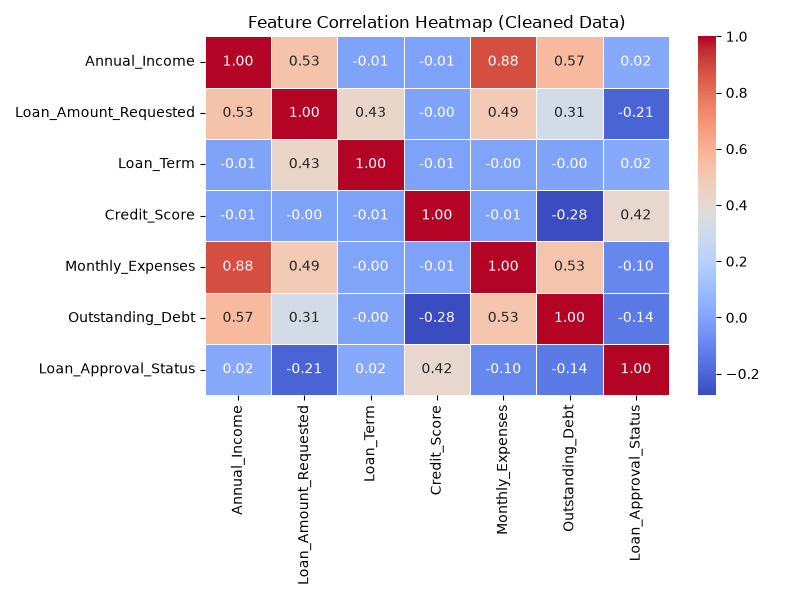

# Feature Correlation Heatmap Analysis

### What It Shows
* **Linear relationships:** Displays Pearson correlation coefficients across numeric features ranging from `-1.0` to `+1.0`.
* **High multicollinearity:** Strong positive correlation between `Annual_Income` and `Monthly_Expenses` (`0.88`), as well as `Annual_Income` and `Outstanding_Debt` (`0.57`).
* **Key target driver:** `Credit_Score` shows the highest positive correlation with `Loan_Approval_Status` (`0.42`).
* **Inverse driver:** `Loan_Amount_Requested` correlates negatively with approval status (`-0.21`).

---

### Role in the Project
* **Detects Multicollinearity:** Confirms that `Annual_Income` and `Monthly_Expenses` share redundant variance, requiring feature selection or regularization to protect linear/distance-based models.
* **Feature Importance Guidance:** Highlights `Credit_Score` as the single most influential numerical predictor for the classification model.
* **Guides Preprocessing:** Informs dimensionality reduction, preventing overfitting and unstable model weights.