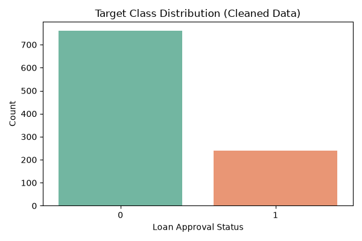

# Target Class Distribution Analysis

### What It Shows
* **The target variable:** Displays the balance between rejected loans (`0`) and approved loans (`1`).
* **The split:** ~76% rejections (~760 applicants) vs. ~24% approvals (~240 applicants).

---

### Role in the Project
* **Detects Class Imbalance:** Confirms the dataset is heavily skewed toward rejection before model training begins.
* **Prevents Misleading Accuracy:** Alerts that raw accuracy is unreliable (a dummy model predicting all `0`s would falsely claim 76% accuracy).
* **Directs Preprocessing & Evaluation:** Mandates the use of balancing strategies (SMOTE, class weights) and evaluation metrics such as F1-Score and ROC-AUC instead of standard accuracy.